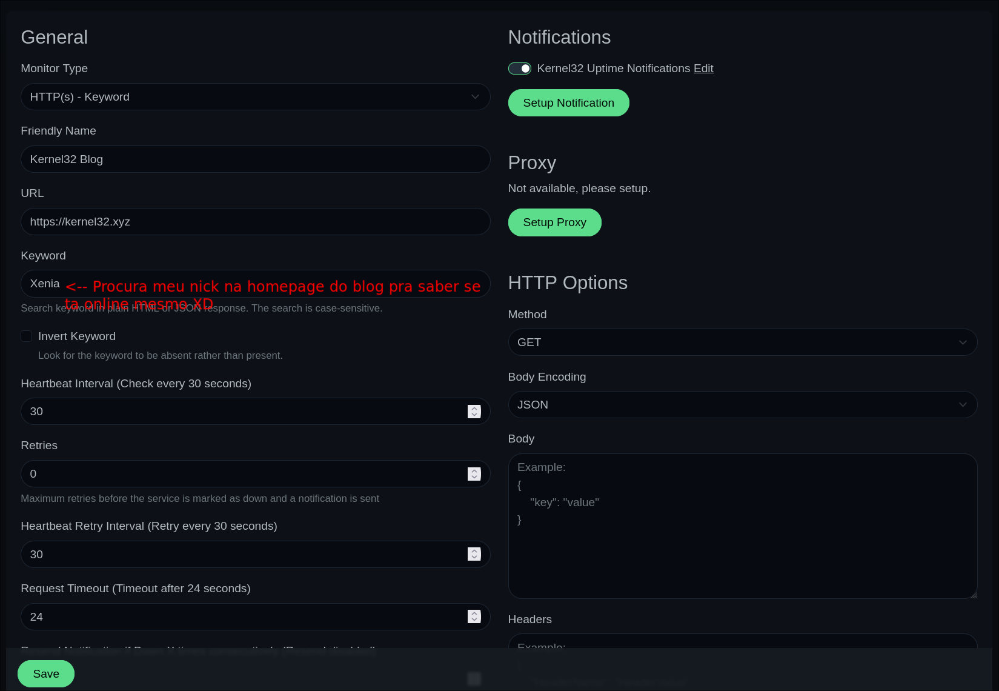
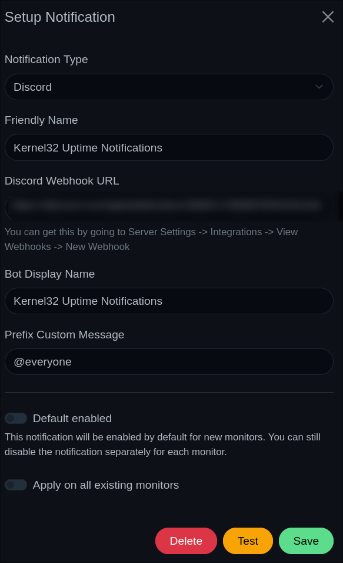
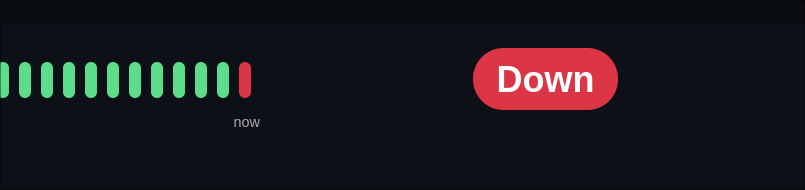
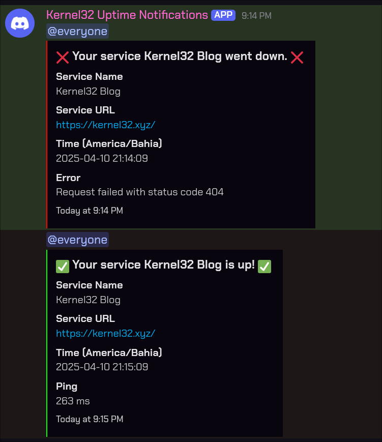

+++
title = 'Monitorando uptime do meu blog porque Cloudflare caiu e demorei pra notar'
date = 2025-04-10
slug = 'uptime-do-meu-blog'
draft = false
categories = ["homelab"]
tags = ["homelab", "kubernetes", "k3s", "uptime"]
+++

É o que o título diz --- Tentei acessar este site na bela tarde de hoje e descobri que estava offline. :D

Nenhum erro do meu lado, olhei o [Cloudflare Status](https://www.cloudflarestatus.com/) e descobri que a proxy reversa (de proteção contra DDoS) caiu.

Claro, ativar o modo de desenvolvimento (que burla a proxy reversa e o cache da Cloudflare) resolveu o problema enquanto eles resolvem a questão do lado deles, mas decidi hospedar uma instância do [Uptime Kuma](https://uptime.kuma.pet/) pra me notificar quando meu blog cair de novo.
<!--more-->
---

Subir uma instância do Uptime Kuma no Kubernetes é simples de mais: só criar um novo namespace para os serviços monitoramento, e instalar a aplicação via Helm:

```bash
$ kubectl create ns monitor
```

```bash
$ helm repo add uptime-kuma https://helm.irsigler.cloud
$ helm repo update
$ helm upgrade uptime uptime-kuma/uptime-kuma --install -n monitor
```

Agora, só me resta *deployar* um ingress para expor o serviço na minha rede interna:

```bash
# identificando o serviço e a porta pra colocar no ingress
$ kubectl get svc -n monitor
NAME                 TYPE        CLUSTER-IP      EXTERNAL-IP   PORT(S)    AGE
uptime-uptime-kuma   ClusterIP   CENSURADO       <none>        3001/TCP   102m
```

```yaml
# ~/lab/monitor/uptime-ingress.yaml
apiVersion: networking.k8s.io/v1
kind: Ingress
metadata:
  name: uptime-ingress
  namespace: monitor
  annotations:
    kubernetes.io/ingress.class: "nginx"
spec:
  rules:
  - host: uptime.monitor.skunklab.local
    http:
      paths:
      - path: /
        pathType: Prefix
        backend:
          service:
            name: uptime-uptime-kuma
            port:
              number: 3001
```

```bash
$ kubectl apply -f ~/lab/monitor/uptime-ingress.yaml
```

## Configurando o Uptime Kuma

Implementei a seguinte configuração para o *Uptime Monitor* do meu blog:



Para as notificações (o "Kernel32 Uptime Notifications" na print), eu coloquei pra me enviar mensagens em um servidor do Discord que só tem eu via um webhook, marcando `@everyone`:



## Testando

Tirei o blog do ar temporariamente pra testar o Uptime Kuma:

```bash
$ kubectl delete -f deploy/k8s.yaml
```

E.... FUNCIONOU!





```bash
$ kubectl apply -f deploy/k8s.yaml
```
